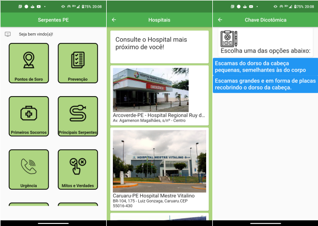
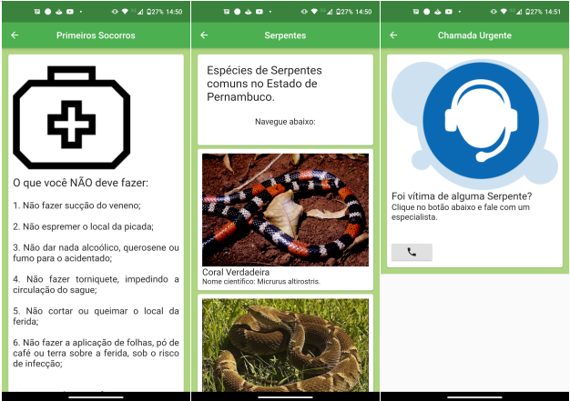

# Disciplina: Fundamentos de Programação Aplicada
## Licença do Projeto
Em breve.

## Sobre o Projeto
O App Serpentes Pernambucanas tem como finalidade auxiliar profissionais da saúde, vítimas de picadas de serpentes e a população geral, a respeito dos mais variados tipos de serpentes encontradas no Estado de Pernambuco, permitindo a realização de consultas sobre os tipos de serpentes, apresentação de medidas de prevenção, informação a respeito das ocorrências no Estado, orientação do ponto mais próximo de estoque de soros antiveneno, assim como, orientar o profissional de saúde na escolha do soro específico para o tipo de espécie que a vítima sofreu a lesão.

## Logotipo do Projeto

## Layout Mobile
             

## Widget Tree

## Navegação
   

## Back End
- Firebase
- Back4app
- Parse
- Backendless
- AWS Amplify

## Front End
- Flutter

## Como instalar o App
O aplicativo estará disponível para download nas plataformas: Android e iOS, com um adendo, que a funcionalidade geolocalização inicialmente vai requerer conexão com a Internet.

## Autor
Paulo Henrique Ramos.

E-mail: phrinformatica@gmail.com
